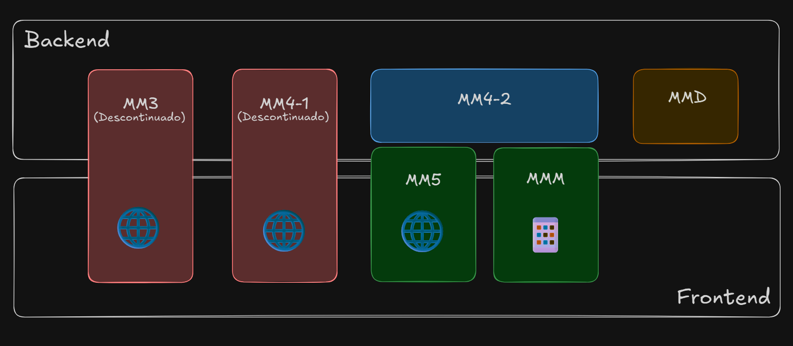

<!-- 
    Este conteúdo replica o mesmo conteúdo contido no "Curso Framework MM4 Banrisul" (https://github.com/dbserver/curso-framework-mm4-banrisul-csharp/blob/ad8d316338de0a2f7ac105d618c4db0a820b2db4/dia-03/05-frameworks-mm-mm4/01-conteudo.md) com algumas leves mudanças específicas do contexto de MM5.

    - Ao iniciar este "Curso Framework MM5 Banrisul", copie novamente o conteúdo referido acima para este arquivo e verifique as mudanças através de um diff simples, de forma a garantir que todos os elementos sejam atualizados corretamente — ao fazer isso, mantenha as mudanças contextuais sinalizadas com o comentário: "Ajuste de contexto MM5".

    ATENÇÃO: Jamais apague esse comentário.
-->

<!-- Ajuste de contexto MM5 -->
# Frameworks, MM e o MM5

Um framework é uma **estrutura de software que fornece um conjunto organizado de componentes reutilizáveis, padrões arquiteturais, bibliotecas, ferramentas e regras de uso** que facilitam o desenvolvimento de aplicações. Ele funciona como um esqueleto pré-definido, sobre o qual soluções específicas podem ser construídas, garantindo consistência, produtividade e previsibilidade ao longo do ciclo de desenvolvimento.

Ao contrário de bibliotecas isoladas, que o desenvolvedor utiliza conforme necessidade, um framework geralmente define o fluxo principal da aplicação, estabelecendo **como** e **quando** seus componentes serão utilizados. Assim, o desenvolvedor escreve o código que "preenche" as partes necessárias dentro de uma estrutura já validada.

Frameworks não são apenas conjuntos de classes ou funções — eles materializam uma forma particular de resolver problemas, apoiada por decisões arquiteturais, práticas recomendadas e mecanismos de padronização.

Principais características de um framework:

- Reutilização estruturada: Evita retrabalho, pois funcionalidades comuns já vêm prontas;
- Padrões e boas práticas incorporados: Encapsula convenções de arquitetura, segurança, manutenção e estilo;
- Extensibilidade: permite adicionar comportamentos específicos sem modificar sua base;
- Fluxo definido: O fluxo principal é conduzido pelo framework — o desenvolvedor implementa as funcionalidades em cima de pontos definidos do fluxo;
- Consistência entre projetos: Projetos que usam o mesmo framework tendem a seguir a mesma linha estrutural e de qualidade;
- Produtividade aumentada: Acelera entregas, reduz erros e diminui a curva de aprendizagem interna.

Usar um framework é trabalhar dentro de um **ambiente com regras**:

- Você ganha componentes que já resolvem problemas comuns;
- Ganha uma arquitetura consistente;
- Ganha ferramentas e convenções.

Em troca, seu código se adapta ao modo de funcionamento do framework e essa relação aumenta a eficiência e reduz drasticamente o "custo cognitivo" de manutenção.

<!-- Ajuste de contexto MM5 -->
Ao longo da jornada vamos trabalhar exclusivamente com as ferramentas, padrões e utilitários do framework [MM5](/dicionario-banrisul.md#mm5---meta-modelo-versão-5), porém, é importante antes de aprofundar no MM5, conhecer também os demais integrantes da família de frameworks [MM](/dicionario-banrisul.md#mm---meta-modelo).

## Frameworks MM

Os frameworks da família **[MM](/dicionario-banrisul.md#mm---meta-modelo)** seguem fielmente o conceito de framework descritos acima.

A seguir vamos conhecer cada integrante da família MM, e sus objetivos com enfoque de atendimento das 3 principais plataformas do ecossistema Banrisul: Web, Mobile e Serviços de backoffice.

### MM3, MM4 e MM5 (Web)

- O **[MM3](/dicionario-banrisul.md#mm3---meta-modelo-versão-3)** utilizava as tecnologias `ASP` e `VB6`, sendo o primeiro MM desenvolvido para a plataforma web. Está descontinuado, e sua descontinuação se deu devido a desafios relacionados a desempenho e manutenção frente às limitações das tecnologias e o término do suporte oficial da Microsoft;
- O **[MM4](/dicionario-banrisul.md#mm4---meta-modelo-versão-4)** utiliza essencialmente `ASP.NET` e `C#`, e é o substituto natural do MM3 para atendimento à web. Possui camadas de backend e frontend, porém, seu frontend (no formato de arquivos `XHTML` em uma dinâmica de renderização do lado servidor) está em processo de descontinuação;
- O **[MM5](/dicionario-banrisul.md#mm5---meta-modelo-versão-5)** utiliza-se da dinâmica de [SPA](/dicionario-banrisul.md#spa---single-page-application)s com a maior parte da renderização do lado cliente, com uso de arquivos padrão HTML (HTML5). Tem como principal objetivo substituir o frontend do MM4.

> Dica: A associação entre MM4 e MM5 pode gerar certa confusão. Para fins de melhor compreensão, mantenha sempre em mente que a relação MM4 e MM5 não é de total substituição, e sim de **coexistência com substituição apenas do frontend**.

### MMM (Mobile)

- O **[MMM](/dicionario-banrisul.md#mmm---meta-modelo-mobile)** é uma adaptação do MM5 que atende à plataforma mobile através do uso do **Apache Cordova**, que utiliza uma abordagem de **WebViews** para prover aplicativos híbridos e cross plataforma com acesso aos recursos (às APIs) dos aparelhos móveis através de plugins.

> Dica: Considere a mesma dinâmica de associação entre MMM e MM4 que o MM5 tem para com o MM4. Ou seja, **MMM também é só frontend, porém nesse caso mobile**.

### MMD (Serviços)

- O **[MMD](/dicionario-banrisul.md#mmd---meta-modelo-daemon)** utiliza Java, e tem como objetivo fornecer a camada de serviços automatizados do banco, abrangendo camadas de integração com o legado, operações recorrentes e transações em massa, através de ambientes de alta disponibilidade, alta taxa de transferência (throughput) e baixa latência.

## Foco de cada componente dos MMs



<!-- Ajuste de contexto MM5 -->
Embora o [MM5](/dicionario-banrisul.md#mm5---meta-modelo-versão-5) seja entendido puramente como o frontend, na imagem podemos perceber que ele transpassa a fronteira do frontend e tem uma leve presença no backend. Isso se dá justamente por causa do provimento dos arquivos estáticos iniciais do frontend web (`HTML`, `CSS` e `JavaScript`), feito pelo backend, que atua como ponto de partida para a "inicialização" da aplicação frontend. Veremos isso em mais detalhes nos próximos tópicos.

<!-- Ajuste de contexto MM5 (Todo o laboratório até o fim) -->
## Laboratório

Neste laboratório vamos importar novamente o _boilerplate_ de **Cliente-Servidor - v7** fornecido na pasta da aula. Você perceberá que agora a aplicação frontend (relembrando: localizada no projeto **Cliente** — pasta **wwwroot**) conta também com um _"framework"_ (em `[...]\wwwroot\pseudo-framework\[...]`), que como explicamos, tem por função agregar funcionalidades e padronizar e convencionar práticas. No nosso caso o framework agregou as funcionalidades de roteamento da aplicação frontend através do objeto `Roteador`, estabeleceu uma padronização de criação de arquivos para que o roteador saiba como tratar as "telas" da aplicação, e também disponibilizou um cliente de requisições HTTP para comunicação com o servidor através do objeto `ClienteHttp`.
<!-- Boilerplate em [./_assets/02-cliente-servidor-boilerplate-v7/] -->

Ou seja, a partir deste ponto, o `index.html` deixa de conter diretamente as telas da aplicação.
Ele passa a funcionar apenas como uma espécie de **container**, enquanto cada tela passa a ser definida por arquivos independentes dentro da convenção estabelecida pelo framework.

O framework covenciona que a estrutura deverá seguir o seguinte padrão:

```makefile
ClienteServidor\                        # Pasta da solução
|
├── Cliente\                            # Pasta do projeto Cliente 
|   ├── [...]                           # Outras pastas e arquivos da estrutura omitidos por brevidade
|   |
|   ├── wwwroot\                        # Pasta base de provimento do frontend (a partir dessa pasta o servidor de arquivos estáticos procurará os arquivos solicitados nas requisições)
|   |   ├── scripts\                    # Pasta de arquivos JavaScript e JQuery do frontend (arquivos da pasta omitidos por brevidade)
|   |   ├── styles\                     # Pasta de arquivos CSS do frontend (arquivos da pasta omitidos por brevidade)
|   |   ├── pseudo-framework\           # Pasta de arquivos do framework de frontend (arquivos da pasta omitidos por brevidade)
|   |   ├── telas\                      # Pasta de arquivos das telas do frontend — seguindo a convenção do framework
|   |   │   ├── exemplos\               # Pasta da tela de exemplos
|   |   │   │   ├── tela-exemplos.html  # Arquivo HTML da tela de exemplos
|   |   │   │   ├── tela-exemplos.css   # Arquivo CSS da tela de exemplos
|   |   │   │   └── tela-exemplos.js    # Arquivo JavaScript e JQuery da tela de exemplos
|   |   │   ├── idiomas\                # Pasta da tela de idiomas (arquivos da pasta omitidos por brevidade)
|   |   │   └── categorias\             # Pasta da tela de categorias (arquivos da pasta omitidos por brevidade)
|   |   └── index.html                  # Arquivo base inicial do frontend (inicialização da aplicação frontend a partir dele)
|   |
|   └── [...]                           # Outras pastas e arquivos da estrutura omitidos por brevidade
|
└── [...]                               # Outras pastas e arquivos da estrutura omitidos por brevidade
```

O `index.html` já está importando tanto o roteador do framework (`<script src="pseudo-framework/scripts/roteador.js"></script>`) quanto o cliente HTTP (`<script src="pseudo-framework/scripts/cliente-http.js"></script>`), o que significa que a partir do `app.js` ou qualquer outro arquivo JavaScript que seja carregado pela aplicação (inclusive os específicos para as telas), os objetos `Roteador` e `ClienteHttp` já estarão disponíveis para uso. Neste momento vamos usar apenas o `Roteador` para adaptarmos o carregamento das telas.

### Passo 1: Criar a estrutura de pastas e arquivos das telas

Dentro da pasta `wwwroot`, vamos criar a pasta `telas` e, dentro dela, as três subpastas que seguem os mesmos recursos que estavam originalmente na aplicação Cliente-Servidor quando ela ainda carregava as telas diretamente na aplicação C# console:

- `exemplos`;
- `idiomas`;
- `categorias`.

> Nota: Ainda temos a "estrutura legada" dentro do projeto **Cliente** que nos dá as pistas de com quais recursos vamos trabalhar: pastas `Telas` e `DTOs` — além dos métodos agora não mais utilizados dentro da `Program.cs`.

Em cada uma das 3 pastas criadas, vamos criar três arquivos seguindo a convenção:

```makefile
ClienteServidor\                          # Pasta da solução
|
├── Cliente\                              # Pasta do projeto Cliente 
|   ├── [...]                             # Outras pastas e arquivos da estrutura omitidos por brevidade
|   |
|   ├── wwwroot\                          # Pasta base de provimento do frontend (a partir dessa pasta o servidor de arquivos estáticos procurará os arquivos solicitados nas requisições)
|   |   ├── [...]                         # Outras pastas e arquivos da estrutura omitidos por brevidade
|   |   |
|   |   ├── telas\                        # Pasta de arquivos das telas do frontend — seguindo a convenção do framework
|   |   │   ├── exemplos\                 # Pasta da tela de exemplos
|   |   │   │   ├── tela-exemplos.html    # Arquivo HTML da tela de exemplos
|   |   │   │   ├── tela-exemplos.css     # Arquivo CSS da tela de exemplos
|   |   │   │   └── tela-exemplos.js      # Arquivo JavaScript e JQuery da tela de exemplos
|   |   │   ├── idiomas\                  # Pasta da tela de idiomas
|   |   │   │   ├── tela-idiomas.html     # Arquivo HTML da tela de idiomas
|   |   │   │   ├── tela-idiomas.css      # Arquivo CSS da tela de idiomas
|   |   │   │   └── tela-idiomas.js       # Arquivo JavaScript e JQuery da tela de idiomas
|   |   │   └── categorias\               # Pasta da tela de categorias
|   |   │       ├── tela-categorias.html  # Arquivo HTML da tela de categorias
|   |   │       ├── tela-categorias.css   # Arquivo CSS da tela de categorias
|   |   │       └── tela-categorias.js    # Arquivo JavaScript e JQuery da tela de categorias
|   |   |
|   |   └── [...]                         # Outras pastas e arquivos da estrutura omitidos por brevidade
|   |
|   └── [...]                             # Outras pastas e arquivos da estrutura omitidos por brevidade
|
└── [...]                                 # Outras pastas e arquivos da estrutura omitidos por brevidade
```

### Passo 2: Atualizar os HTMLs das telas

Os HTMLs das telas não precisam ser HTMLs "completos" (com por exemplo as tags `<html>`, `<head>`, `<body>`, etc), pois o roteador do framework irá pos si só "injetar" as telas dentro do próprio `index.html` principal. Portanto, os arquivos HTML das telas conterão apenas o conteúdo específico de cada tela.

vamos apenas começar transportando as tags que havíamos colocado anteriormente dentro do `app.js` via codificação — agora aplicando como tags HTML de fato dentro de cada uma das telas.

Por exemplo: o que antes estava dentro do `app.js` assim:

```javascript
//[...]

function montarTelaExemplos() {
    document.getElementById('conteudo').innerHTML = '<h2>Tela de Exemplos</h2>';
}

// [...]
```

Agora vamos extrair o `h2` para o arquivo `tela-exemplos.html`, ficando assim:

```html
<h2>Tela de Exemplos</h2>
```

> Notas:
>
> - O exemplo de HTML acima, apesar de parecer estranho em primeiro momento, é de fato o **conteúdo total do arquivo `tela-exemplos.html`**;
> - Vamos fazer o mesmo para as outras duas telas (idiomas e categorias);
> - Podemos deixar por enquanto o `app.js` como está — a seguir vamos fazer as adaptações necessárias;
> - Os arquivos JavaScript e CSS das telas ficarão vazios por enquanto — vamos utilizá-los conforme necessário.

### Passo 3: Adaptar o `app.js` para usar o roteamento do framework

Agora sim, vamos adaptar o `app.js` para implementar o uso do roteador do framework através dos trechos comentados com **TODO**:

```js
document.addEventListener('DOMContentLoaded', inicializar);

// TODO: Criação do mapa de telas para registrar no roteador
const MAPA_TELAS = {
    exemplos: 'exemplos',
    idiomas: 'idiomas',
    categorias: 'categorias'
};

function inicializar() {
    // TODO: Registro das telas no roteador (requisito do framework)
    Roteador.telas.adicionar(MAPA_TELAS['exemplos']);
    Roteador.telas.adicionar(MAPA_TELAS['idiomas']);
    Roteador.telas.adicionar(MAPA_TELAS['categorias']);

    mapearAcaoBotoes();
}

function mapearAcaoBotoes() {
    document
        .getElementById('btn-exemplos')
        .addEventListener('click', montarTelaExemplos);

    document
        .getElementById('btn-idiomas')
        .addEventListener('click', montarTelaIdiomas);

    document
        .getElementById('btn-categorias')
        .addEventListener('click', montarTelaCategorias);
}

function montarTelaExemplos() {
    // TODO: Remoção da montagem manual da tela de exemplos
    // document.getElementById('conteudo').innerHTML = '<h2>Tela de Exemplos</h2>';

    // TODO: Carregamento integrado da tela de exemplos através do roteador
    Roteador.carregar(MAPA_TELAS['exemplos']);
}

function montarTelaIdiomas() {
    // TODO: Remoção da montagem manual da tela de idiomas
    // document.getElementById('conteudo').innerHTML = '<h2>Tela de Idiomas</h2>';

    // TODO: Carregamento integrado da tela de idiomas através do roteador
    Roteador.carregar(MAPA_TELAS['idiomas']);
}

function montarTelaCategorias() {
    // TODO: Remoção da montagem manual da tela de categorias
    // document.getElementById('conteudo').innerHTML = '<h2>Tela de Categorias</h2>';

    // TODO: Carregamento integrado da tela de categorias através do roteador
    Roteador.carregar(MAPA_TELAS['categorias']);
}
```

> Notas:
>
> - Após concluído, os comentários com **TODO** podem ser removidos;
> - Trechos que foram comentados devido à necessidade de remoção agora também podem ser completamente removidos.

### Passo 4: Atualizar os JavaScripts das telas para atenderem aos requisitos de inicialização

Para que as telas inicializem corretamente, o framework estabelece que cada tela possua um método **inicializador**, que será chamado automaticamente pelo roteador do framework sempre que a tela for carregada — essa é uma chamada _premissa de lifecycle_, e frameworks consagrados de mercado possuem vários recursos semelhantes para tratar ciclos de vida de páginas (que aqui chamamos de telas) e componentes.

Para fazer a adaptação de inicialização, vamos criar a função `inicializar` dentro de cada um dos arquivos JavaScript das telas, e também vamos fazer o registro do inicializador dentro do roteador, ficando assim:

```javascript
(function () {
    Roteador.telas.registrarInicializador(MAPA_TELAS['exemplos'], inicializar);

    /*
     * Aqui outras definições gerais para a tela de exemplos
    */

    function inicializar() {
        // Aqui será colocado o código necessário para a inicialização adequada dos recursos da tela de exemplos
        console.log('Tela ' + NOME_TELA + ' inicializada!');
    }
    
    /*
     * Aqui seguirá o código específico da tela de exemplos
    */
})();
```

> Notas:
>
> - Vamos fazer o mesmo para as outras duas telas (idiomas e categorias);
> - A utilização da técnica [IIFE](../../dicionario-banrisul.md#iife---immediately-invoked-function-expression) (`(function () { [...] })();`) é importante dentro das telas, para que não hajam colisões de objetos com mesmo nome no escopo global.

Vamos executar novamente o projeto **Cliente** e verificar que o frontend continua carregando todas as telas normalmente, porém agora através das convenções e padronizações de roteamento do framework, com uma estrutura completamente modularizada de arquivos.

> Nota: No console do navegador também podemos verificar as mensagens de inicialização das telas conforme vamos navegando entre elas.

## [Exercícios](02-exercicios.md)
