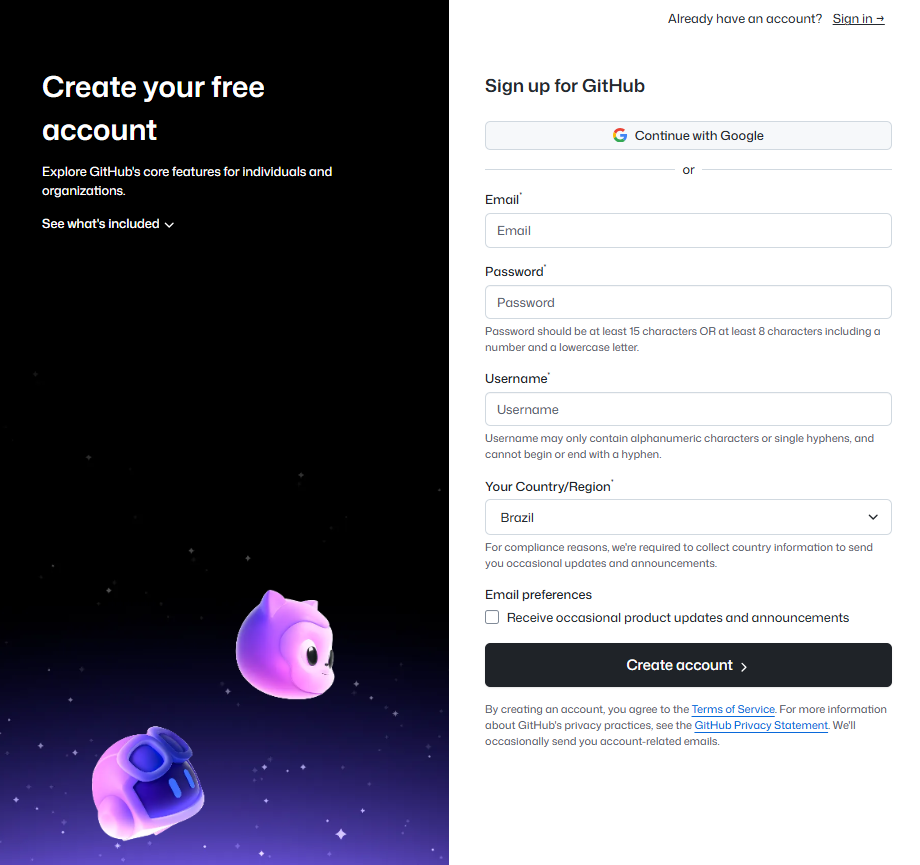
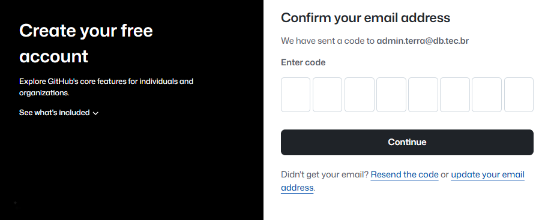
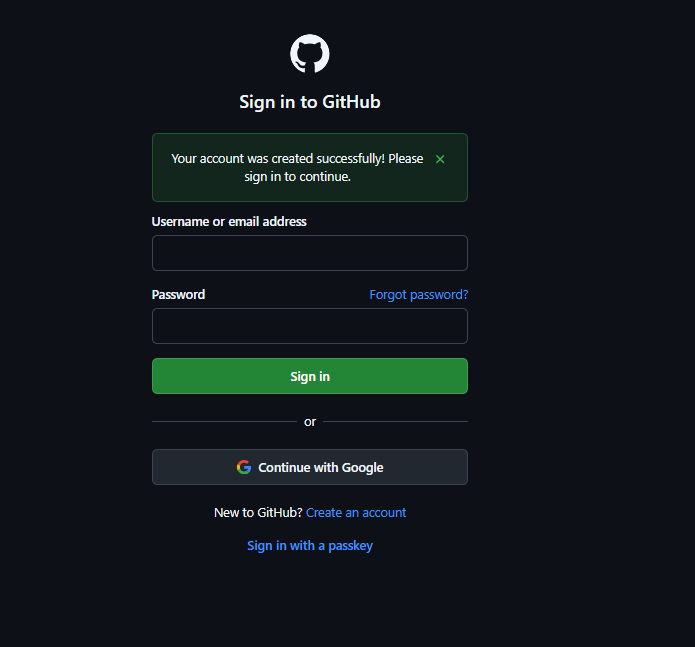
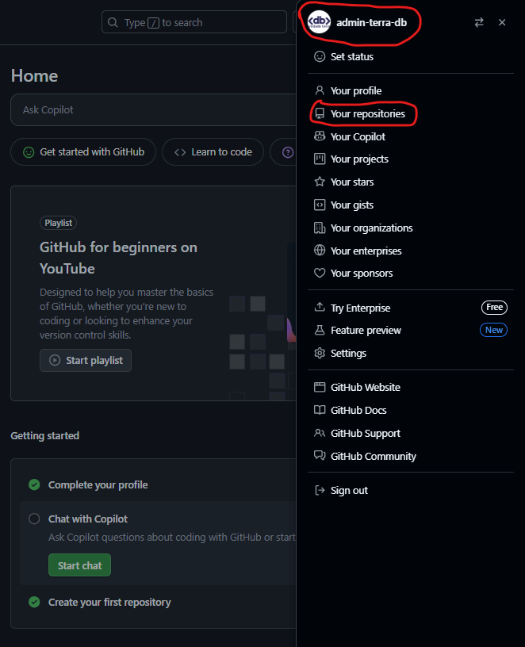
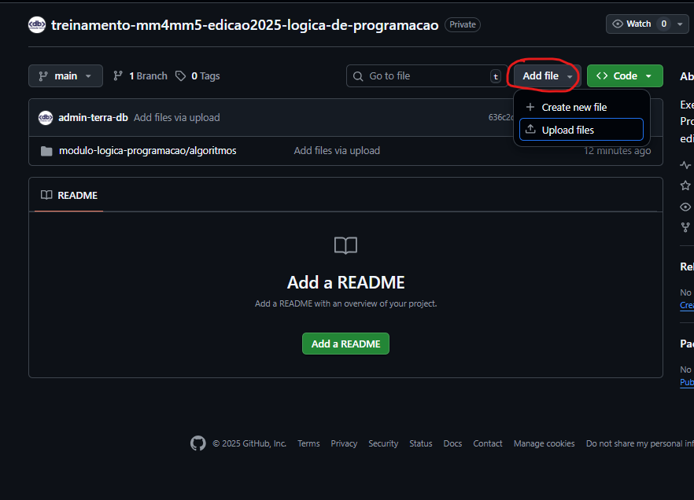

# Introdução básica ao Github

## 1. Contexto

Antes de entender o GitHub, é importante saber de forma bem superficial o que é versionamento de códigos-fonte, e como isso é resolvido com o _Git_.

### Versionamento

Versionamento é o processo de registrar alterações de documentos, arquivos ou projetos ao longo do tempo, permitindo que seja possível de se **voltar a versões anteriores**, comparar mudanças e acompanhar a evolução do conteúdo ao longo do tempo. Se aplica a qualquer tipo de documento, projeto ou sistema que precise de um controle histórico.

### Versionamento de códigos-fonte

Em códigos-fonte, o versionamento permite que os desenvolvedores **acompanhem cada alteração realizada no código**, saibam quem fez a mudança, quando e por quê. facilitando a **colaboração entre equipes**, evitando conflitos de edição simultânea e mantendo um controle histórico confiável de todo o ciclo de vida do software.

> Código-fonte: Conjunto de instruções (em um ou mais arquivos) escritas em uma dada linguagem de programação, em um ou mais arquivos, que definem o comportamento de um software.

### Git

O _Git_ é um protocolo, expressado através de um software com o mesmo nome, criado por _Linus Torvalds_ em 2005 com o intuito de resolver o problema de controle de versionamento (de códigos-fonte principalmente) através de um mecanismo distribuído, permitindo gerenciar históricos de alterações em arquivos entre múltiplas origens, possibilitando assim a colaboração entre vários desenvolvedores através de diferentes computadores de forma autocontida e autossuficiente (característica distribuída).

### Github

O _GitHub_ é uma **plataforma online** que utiliza o protocolo _Git_ para hospedar e gerenciar repositórios de arquivos (códigos-fonte). Ele funciona como um centralizador, permitindo que equipes distribuídas colaborem de forma organizada, compartilhem códigos-fonte, rastreiem alterações e resolvam conflitos. Possui funcionalidades que lembram uma **rede social de desenvolvedores**, como comentários em _commits_, _pull requests_, _issues_ e _wikis_, e oferece integração com ferramentas de CI/CD, automações e gerenciamento de projetos, tornando a colaboração mais rica e sofisticada.

> **CI**: _Continuous Integration_ (Integração Contínua) é a prática de integrar automaticamente o código em ambientes de teste sempre que uma alteração é feita, garantindo que o software continue sendo testado.<br/>
> **CD**: _Continuous Delivery_ (Entrega Contínua) é a prática de preparar automaticamente as alterações aprovadas para produção, permitindo que novas funcionalidades cheguem aos usuários de forma rápida e segura.

## 2. Trabalhando com o Github

### Criação de conta

Acessando a [página do Github](https://github.com/?locale=pt-br), você encontrará o botão `Criar uma conta`. Clique nele:


Haverá então um redirecionamento para o formulário de registro. Preencha todas as informações conforme solicitado:



> Dica: O `username` é o ID global único que identificará você para o mundo — escolha com sabedoria.

Após preenchido e enviado o formulário, uma tela de checagem aguardando o código recebido por e-mail será exibida:



E um e-mail será recebido na sua caixa de entrada:


Basta preencher o código recebido na tela, para que o e-mail seja confirmado e haja um redirecionamento para a tela de login:



Agora basta usar suas credenciais registradas para efetuar login normalmente.

> Dica (opcional): Ative o **2FA** para garantir a segurança de sua nova conta do Github: [Proteção com 2FA](https://docs.github.com/pt/authentication/securing-your-account-with-two-factor-authentication-2fa).

### Criação de repositórios

O repositório, dentro do contexto do Github, nada mais é do que uma representação da pasta do seu projeto, exatamente como estaria na sua máquina local. Repositórios são flexíveis, podem conter inclusive mais de um projeto ao mesmo tempo, tudo depende de como for configurado.

Já com login efetuado dentro da sua conta do Github, você pode criar um novo repositório através de `[+] > New repository` (localizado na parte superior direita):


O formulário para registro de um novo repositório será exibido, preencha ao menos com o **nome único** e garantindo a **visibilidade correta** do repositório:


- Repository name: Nome único utilizado para identificação do repositório (inclusive nas URLs de acesso). Ele é composto por uma junção do nome do próprio usuário com o nome dado ao repositório — escolha com sabedoria.
- Description: Uma descrição geral para que quem acessa entenda para que serve(m) o(s) projeto(s) localizado(s) no repositório.
- Visibility: Configuração muito importante que dita se esse repositório será visível e poderá ser acessado por outros usuários ou somente pelo próprio dono.
- Add README: Opção que sugere a adição de um arquivo `README.md`, comumente usado para documentar de forma mais detalhada as informações do repositório (pense nele como um description com muito mais recursos).
- Add .gitignore: Opção que sugere a adição de um arquivo `.gitignore`, comumente usado para servir de indicador de exclusão para arquivos que **não se quer versionar** no projeto, ou seja, tudo que estiver descrito nele será ignorado (não será enviado junto) quando envios do projeto forem feitos para o repositório.
- Add license: Opção que sugere a adição de um arquivo `LICENSE`, usado para deixar claro como outras pessoas podem usar, copiar ou modificar o projeto. Ou seja, ele define regras de compartilhamento e proteção legal do código, ajudando a garantir que o dono (autor) tenha seus direitos respeitados e que quem usar o projeto saiba o que é permitido.

Após criado o repositório, ele e outros poderão ser acessados através de `(avatar do usuário) > Your repositories` (localizado na parte superior direita):



### Versionamento simples de arquivos (códigos-fonte)

O versionamento do código-fonte no repositório do Github pode ser feito de diferentes maneiras. Você utilizará a mais rudimentar delas através do recurso de _drag and drop_ no navegador:

#### Preparando a estrutura

No seu computador (em Desktop, Documents ou onde preferir), crie uma pasta `modulo-logica-programacao`:


> Nota: Estamos usando o _casing_ `kebab-case` (todas as letras minúsculas, sem acentos, espaços ou cedilha, com palavras separadas por _hífen_), que é a _naming convention_ mais comum utilizada para se versionar arquivos no Github.

Após, dentro da pasta recém criada adicione mais uma pasta `algoritmos`:


- Transporte um arquivo `.txt` para dentro da pasta `algoritmos`;
- Tire um _print_ da sua tela (ctrl + ⊞ Win + s), e salve a imagem também dentro da pasta `algoritmos`:


A estrutura inicial ficará semelhante a esta:

```md
modulo-logica-programacao
└── algoritmos
    ├── arquivo-algoritmo.txt
    └── arquivo-imagem-print.png
```

#### Primeiro versionamento

Navegue até a página do repositório no Github e clique na opção `Upload an existing file`:


Na tela de _commit_, utilizando o recurso de _drag and drop_, faça o movimento de "arrastar" a partir da pasta raíz `modulo-logica-programacao` para dentro da página, e logo após clique em `Commit changes`:


#### Versionamentos consequentes

Depois de efetuado o primeiro _commit_, a página principal do repositório passará a exibir os arquivos em uma estrutura semelhante à utilizada na pasta local. Para fazer atualizações, basta manter localmente a estrutura como está, adicionar novos arquivos ou alterar os existentes, e fazer novos _drag and drop_ da pasta `modulo-logica-programacao` para o repositório.

Faça mais um _commit_:

- Crie um **novo arquivo** `hello-world.txt` em `modulo-logica-programacao > algoritmos` (com ou sem conteúdo);
- Abra o seu arquivo `txt` de algoritmo e faça uma alteração qualquer no conteúdo;
- **A partir da página principal do repositório**, clique em `Add file > Upload files` (localizado do centro para a direita na tela):



Repita o processo de "arrastar" da pasta raíz `modulo-logica-programacao` para dentro da página de _commit_.
